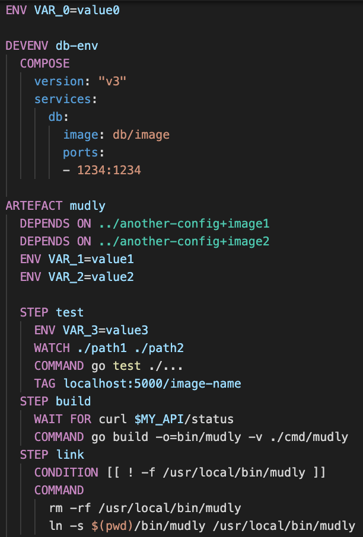

# MUDLY BUILD TOOL

Because sometimes you don't have room to containerise everything

## What is Mudly?

A cheap and cheerful knock-off of the much more impressive https://earthly.dev. It's a build tool that will orchestrate build tasks for you, allow you to in-line and share your dockerfiles and take care of spinning up and shutting down your development environment.

Mudly works entirely out of sub-processes, in your own local environment. This has obvious drawbacks in propagating the "it works on my machine" effect, but avoids the cpu / storage / memory consumption of container-based alternatives.

## What does it look like?

## Docs

Reference:
- [Installation](./docs/installation.md)
- [Command](./docs/command-reference.md)
- [Mudfile](./docs/mudfile-reference.md)
- [Development](./docs/dev-notes.md)